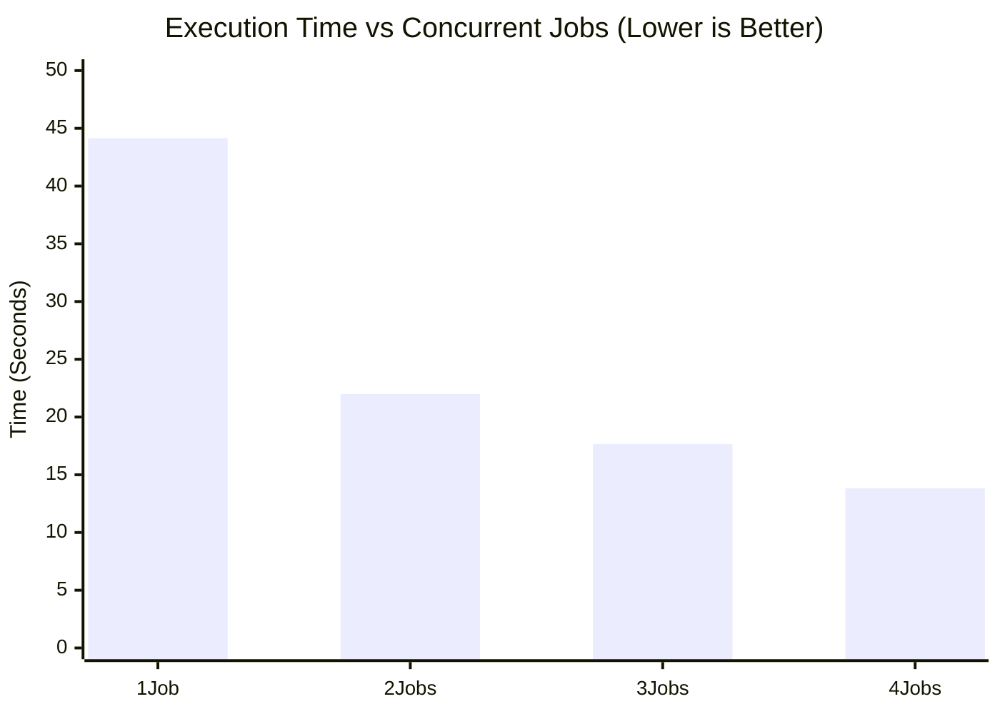

# Parallelization Implementation

## Performance Benchmark

We tested the system with 10 students to measure the speedup gained by increasing the number of concurrent jobs.

**Results (10 Students):**

| Jobs | Time (s) | Speedup |
| :--- | :--- | :--- |
| **1** | 44.15s | 1.00x |
| **2** | 21.99s | 2.01x |
| **3** | 17.66s | 2.50x |
| **4** | 13.83s | 3.19x |



## Overview

We have implemented parallel processing for the PDF generation workflow to significantly reduce the total execution time. Originally, the system processed students sequentially (one after another). The new implementation allows for multiple students to be processed concurrently.

## Technical Details

### Asyncio and Semaphores

The core of the parallelization relies on Python's `asyncio` library.

1.  **Concurrency Model**: We use `asyncio.gather` to schedule processing tasks for all students simultaneously.
2.  **Resource Control**: To prevent system overload (opening too many headless browsers at once), we use an `asyncio.Semaphore`.
    *   The semaphore acts as a gatekeeper, limiting the number of active tasks.
    *   If the limit is set to 2, only 2 students are processed at any given instant. As soon as one finishes, the next one in the queue starts.

### Code Changes

#### `core/orchestrator.py`

*   **`process_student` Function**: The logic for processing a single student (generating HTML and rendering PDF) was extracted into a dedicated asynchronous function.
*   **Semaphore Integration**:
    ```python
    semaphore = asyncio.Semaphore(concurrency_limit)

    async def process_student(...):
        async with semaphore:
            # Critical section: Heavy lifting happens here
            ...
    ```
*   **Batch Execution**:
    ```python
    tasks = [process_student(...) for student in students]
    await asyncio.gather(*tasks)
    ```

#### `run_quiz.py`

*   Added a `--jobs` argument to the CLI.
*   Allows users to specify the concurrency limit (default: 2, max: 4).

## Performance Impact

*   **Sequential (Old)**: ~4.5s per student. Total time = N * 4.5s.
*   **Parallel (New, 2 jobs)**: Effectively ~2.25s per student throughput. Total time ≈ (N * 4.5s) / 2.

## Usage

You can control the parallelism using the `--jobs` flag:

```bash
# Default (2 jobs)
python run_quiz.py --quiz 5 --csv "data.csv"

# Faster (3 jobs)
python run_quiz.py --quiz 5 --csv "data.csv" --jobs 3

# Maximum speed (4 jobs)
python run_quiz.py --quiz 5 --csv "data.csv" --jobs 4
```

## Why Limit to 4?

Each job spawns a headless Chromium instance via Playwright. These are memory and CPU intensive.
*   **Memory**: Each browser instance can consume 100MB-500MB+.
*   **CPU**: Rendering PDFs requires significant CPU cycles.

Running too many concurrent jobs can lead to:
1.  System lag.
2.  Browser crashes / timeouts.
3.  Diminishing returns (CPU thrashing).

We found 2-4 to be the sweet spot for typical developer machines.
